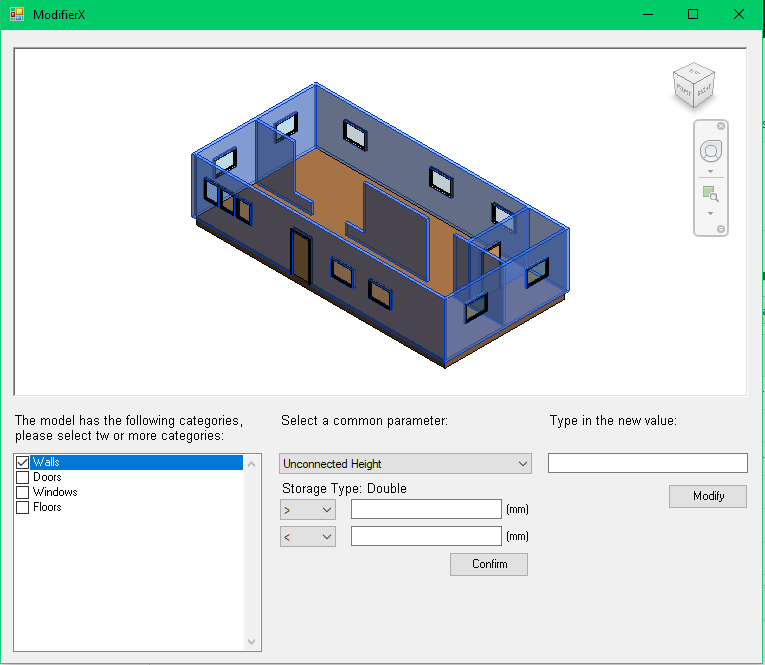

# Revit-Commmon-Parms-Modifier

A practice of Revit add-on

## Requirements

* Revit 2017

## Common steps

* Download and install Revit 2017

* Clone this repo: `git clone https://github.com/HumphreyLu6/Revit-Commmon-Params-Modifier.git`

* Copy CommonParamsModifier.addin that in repo root directory (note: you may need to change the path here to match your CommonParamsModifier.dll location on your computer)

* Paste CommonParamsModifier.addin to C:\ProgramData\Autodesk\Revit\Addins\2017

* Open Revit, give permissions if load confirmation is needed

## Interfaces

